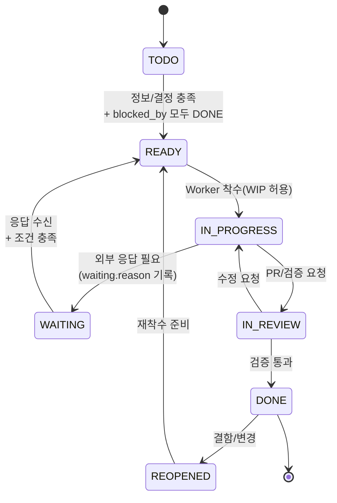
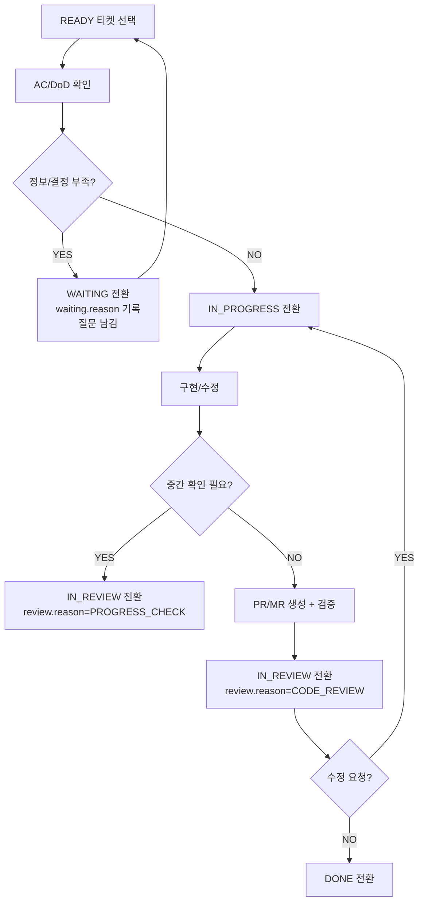
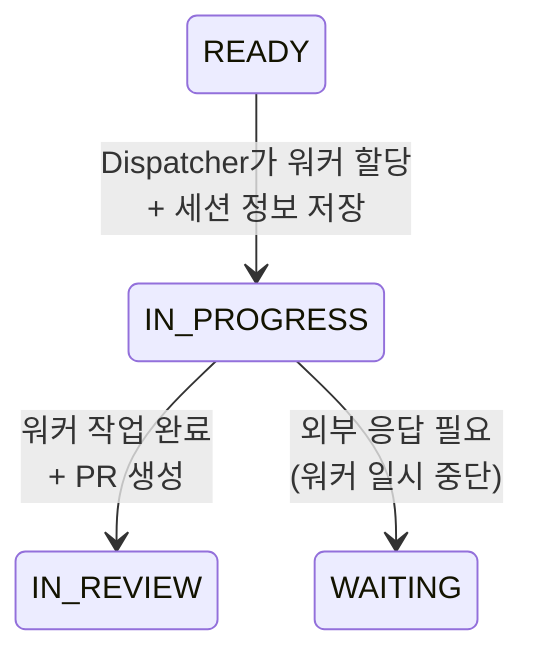

# Coding Agent 분할정복 작업 관리 (개선안)

## TL;DR

- “작업 상태”와 “대기/리뷰 사유”를 분리하면, 복잡한 작업에서 Agent의 방향 오류와 핑퐁을 줄일 수 있다.
- 병렬 실행의 핵심 병목은 **통합(merge)** 이므로, Integrator 역할/규칙을 먼저 둔다.
- Orchestrator는 `READY`(실행 가능) 티켓만 배정하고, 중간 노드는 “검수/통합 전용”으로 다룬다.

## 문제 인식

Coding Agent(Claude Code, Codex 등)를 사용할 때의 대표적인 비효율:

| 작업 유형 | Agent 적합성 | 흔한 문제 |
|----------|-------------|----------|
| 단건/명확한 작업 | 적합 | 거의 없음 |
| 복잡/대규모 작업 | 취약 | 빠른 마무리 경향, 방향 오류, 수정 공수 증가 |

핵심 원인(정리):

1. **빠른 마무리 경향**: “일단 끝”을 우선해 설계/검증이 약해짐
2. **실행 가능성 판단 부재**: 정보/결정/의존성이 부족해도 착수
3. **상태 의미 과적재**: `IN_REVIEW` 하나로 “정보 부족/결정 필요/진행 검토/코드 리뷰”가 섞임
4. **통합 병목**: 병렬로 만들어도 merge/검증이 뒤에서 폭발

## 해결 방향: 분할 정복(Divide and Conquer)

핵심 아이디어:

```
복잡한 문제 → 정확한 정리(요구/성공기준) → 티켓 트리 분할 → 병렬 실행(leaf) → 통합/검수(parent) → 전체 목표 검증
```

## 상태 모델(중요)

### 1) 작업 상태(Workflow Status)

상태는 “일이 가능한지/진행 중인지/검증 중인지”만 표현한다.

| 상태 | 의미 | 누가 움직이나 |
|------|------|--------------|
| TODO | 아직 실행 불가(정보/결정/의존성 부족) | Planner/Owner |
| READY | 실행 가능(착수 대기) | Orchestrator/Worker |
| IN_PROGRESS | 작업 중 | Worker |
| WAITING | 외부 응답/의존성 완료 대기 | Owner(주로 사용자) |
| IN_REVIEW | 검증/리뷰/통합 대기 | Reviewer/Integrator |
| DONE | 완료 | - |
| REOPENED(옵션) | 완료 후 결함/변경으로 재오픈 | Owner |

### 2) 대기/리뷰 사유(Reason)를 별도 필드로 기록

`WAITING`은 “외부 응답을 기다리는 상태”, `IN_REVIEW`는 “검증/리뷰/통합을 기다리는 상태”로 역할을 분리한다.

`WAITING`에서는 **외부 응답 사유만** 다루고, 코드/진행 리뷰는 `IN_REVIEW`에서 다룬다.

```yaml
waiting:
  on: "USER | DEPENDENCY | EXTERNAL"
  reason: "NEEDS_INFO | NEEDS_DECISION | DEPENDENCY | EXTERNAL_RESPONSE"
  questions:
    - "질문 1"
    - "질문 2"
  requested_at: "2026-01-27T10:00:00"
```

```yaml
review:
  reason: "PROGRESS_CHECK | CODE_REVIEW | MERGE_CONFLICT"
  notes:
    - "리뷰 포인트/검증 결과"
```

### 3) 상태 전이 다이어그램



> 포인트: “사용자 답변을 받으면 TODO로 되돌리기”보다 `WAITING → READY`가 운영상 명확하다.

## 티켓 트리(분할) 모델

### 노드 유형

| 유형 | 역할 | 완료 조건 |
|------|------|----------|
| LEAF | 실제 구현/수정 단위 | DoD 충족 + 검증 통과 |
| PARENT | 하위 결과 통합/검수 | 모든 children DONE + 요구사항 충족 검증 |
| ROOT | 전체 목표 검증 | 전체 DONE + 최종 시나리오 검증 |

### 핵심 규칙(운영 룰)

1. Worker 배정은 기본적으로 **LEAF + READY**만 대상
2. PARENT는 “작업”이 아니라 “검수/통합”이므로 Integrator/Reviewer가 처리
3. `children`(트리)와 `blocked_by`(의존성)는 분리해서 관리하고, PARENT/ROOT는 “children 모두 DONE”을 READY 조건으로 둔다(중복 입력 최소화).

### 분할 기준(간단)

```yaml
분할_필요_조건:
  - 작업 복잡도가 높음
  - 작업 시간이 길 것
  - 도메인/기술 영역이 여러 개
  - 병렬 가능한 독립 LEAF가 있음

분할_중단_조건:
  - 한 명(한 Worker)이 실수 없이 끝낼 수 있는 크기
  - 더 이상 독립적으로 나눌 수 없음
  - “원자적 변경” 단위에 도달
```

## 티켓 스키마(권장)

### 최소 스키마

```yaml
ticket:
  id: "TICKET-001-2"
  title: "데이터 모델 추가"
  type: "LEAF | PARENT"
  status: "TODO | READY | IN_PROGRESS | WAITING | IN_REVIEW | DONE | REOPENED"
  priority: "P0 | P1 | P2"
  owner: "human-or-agent"

  blocked_by: ["TICKET-001-1"] # 이 티켓들이 DONE이어야 READY 가능
  parent_id: "TICKET-001"
  children: [] # LEAF면 비움

  content:
    requirement: "무엇을 해야 하나(한 문장)"
    acceptance_criteria:
      - "성공 기준 1"
      - "성공 기준 2"
    constraints:
      - "제약 1(성능/보안/호환성 등)"
    solution_outline: "구현 방향(선택된 안)"
    trade_offs:
      considered:
        - option: "A"
          pros: ["..."]
          cons: ["..."]
      decision: "A"

  definition_of_done:
    checks:
      - "테스트 커맨드/검증 방법"
    artifacts:
      - "PR/MR 링크"
      - "스크린샷/로그 위치"

  waiting: null # 필요 시 위 waiting 구조 사용
  review: null # 필요 시 위 review 구조 사용
  log:
    - at: "2026-01-27T10:00:00"
      event: "STATUS_CHANGE"
      message: "READY → IN_PROGRESS"
```

### DoD(Definition of Done) 템플릿(권장)

- 변경사항이 “요구사항/성공 기준”을 직접 충족하는가?
- 최소 1개 이상의 검증 방법이 명시되어 있는가? (테스트/재현 절차/스크린샷 등)
- 결과물이 링크로 남아있는가? (PR/MR, 커밋, 로그)

## Orchestrator(배정) 규칙

### 실행 가능한 티켓(READY) 정의

`READY`는 “지금 당장 손을 대도 되는 상태”다.

- `blocked_by`가 전부 `DONE`
- `content.acceptance_criteria`가 존재(최소 1개)
- WIP 제한을 넘지 않음(Worker 당 1개 권장)

배정 관점:

- Worker 기본 대상: `type == LEAF && status == READY`
- Integrator 기본 대상: `type == PARENT && status == READY && children_all_done`

### 간단한 배정 알고리즘(예시)

```yaml
assignment:
  worker_candidates: "status==READY && type==LEAF && blocked_by_all_done"
  integrator_candidates: "status==READY && type==PARENT && children_all_done"
  sort: ["priority desc", "created_at asc"]
  wip_limit: "worker당 1"
```

## Worker 워크플로우(개선)

용어:

- AC: Acceptance Criteria(성공 기준)
- DoD: Definition of Done(완료 정의)



## 통합(병렬) 전략: “merge가 병목” 가정

### 기본 원칙

1. **티켓 1개 = 브랜치 1개(=작업 단위 1개)**
2. PR/MR은 작고 자주(충돌 면적 최소화)
3. 충돌이 잦은 파일/모듈은 “소유권(ownership)”을 지정하거나 순차 처리

### 권장 역할 분리

- Worker: LEAF 구현 + PR 생성
- Integrator: PARENT/ROOT 검수, 충돌 해결, 통합 테스트, 릴리즈 판단

### 충돌(Conflict) 대응 룰

- 충돌 발생 시 `review.reason: MERGE_CONFLICT`로 기록하고 Integrator가 책임지고 해결
- 동일 파일을 여러 LEAF가 동시에 건드리지 않게 “작업 영역”을 분할(예: 디렉토리/모듈 단위)

## 기대 효과(정량화 포인트)

| 지표 | 기대 변화 | 측정 아이디어 |
|-----|----------|---------------|
| 재작업 횟수 | 감소 | `IN_REVIEW → IN_PROGRESS` 반복 횟수 |
| 대기 시간 | 가시화 | `WAITING` 체류 시간(Reason별) |
| 리드타임 | 예측 가능 | `READY → DONE` 사이클 타임 |
| 방향 오류율 | 감소 | “AC 미충족으로 REOPENED” 비율 |

## 워커 에이전트 할당 시스템

### 이벤트 루프 아키텍처

워커 에이전트에 티켓을 할당하는 프로세스는 **이벤트 루프 아키텍처**를 차용한다.

```
┌─────────────────────────────────────────────────────────────┐
│                    Event Loop (Python)                       │
├─────────────────────────────────────────────────────────────┤
│                                                              │
│   ┌──────────┐    ┌──────────────┐    ┌──────────────────┐  │
│   │  Ticket  │───▶│  Dispatcher  │───▶│  Worker Agent    │  │
│   │  Queue   │    │              │    │  (Claude CLI)    │  │
│   │ (READY)  │    │  - 가용 워커  │    │  - Background    │  │
│   └──────────┘    │    확인      │    │  - Session 저장  │  │
│        ▲          │  - 티켓 할당  │    └──────────────────┘  │
│        │          └──────────────┘             │             │
│        │                                       │             │
│        └───────────────────────────────────────┘             │
│                    (완료 시 다음 티켓)                        │
│                                                              │
└─────────────────────────────────────────────────────────────┘
```

### 실행 방식

```bash
# 워커 에이전트 개수를 파라미터로 전달
python worker_dispatcher.py --workers 3
```

### 핵심 동작

1. **대기 상태 유지**: 스크립트 실행 후 이벤트 루프가 대기
2. **조건 검사**: 처리 가능한 티켓(`READY`)이 있고, 배치되지 않은 워커가 있는지 확인
3. **백그라운드 실행**: Claude CLI를 이용해 백그라운드에서 티켓 처리
4. **세션 정보 저장**: 티켓에 Claude 세션 정보 기록

### 티켓 스키마 확장

```yaml
ticket:
  # ... 기존 필드 ...

  # 워커 할당 관련 필드
  workspace:
    directory: "/absolute/path/to/work/directory"  # 작업 디렉토리 절대 경로

  agent:
    worker_id: "worker-1"           # 할당된 워커 ID
    session_id: "claude-session-xxx" # Claude 세션 ID
    started_at: "2026-01-27T10:00:00"
    pid: 12345                       # 백그라운드 프로세스 ID
```

### Dispatcher 로직 (의사 코드)

```python
class WorkerDispatcher:
    def __init__(self, worker_count: int):
        self.max_workers = worker_count
        self.active_workers: dict[str, Worker] = {}
        self.ticket_queue = TicketQueue()

    async def run(self):
        """이벤트 루프 실행"""
        while True:
            await self.dispatch_if_possible()
            await self.check_completed_workers()
            await asyncio.sleep(POLL_INTERVAL)

    async def dispatch_if_possible(self):
        """가용 워커가 있고 READY 티켓이 있으면 할당"""
        available_slots = self.max_workers - len(self.active_workers)

        if available_slots <= 0:
            return

        ready_tickets = self.ticket_queue.get_ready_tickets(limit=available_slots)

        for ticket in ready_tickets:
            worker = await self.spawn_worker(ticket)
            self.active_workers[worker.id] = worker

    async def spawn_worker(self, ticket: Ticket) -> Worker:
        """Claude CLI를 백그라운드로 실행하여 워커 생성"""

        # 작업 디렉토리로 이동하여 실행
        cmd = f'cd "{ticket.workspace.directory}" && claude --background ...'

        process = await asyncio.create_subprocess_shell(
            cmd,
            stdout=asyncio.subprocess.PIPE,
            stderr=asyncio.subprocess.PIPE
        )

        # 세션 정보를 티켓에 저장
        ticket.agent = AgentInfo(
            worker_id=generate_worker_id(),
            session_id=extract_session_id(process),
            started_at=datetime.now(),
            pid=process.pid
        )
        ticket.status = "IN_PROGRESS"
        ticket.save()

        return Worker(id=ticket.agent.worker_id, process=process, ticket=ticket)
```

### 워커 실행 명령 예시

```bash
# Dispatcher가 실행하는 실제 명령
cd "/Users/dev/project/feature-auth" && \
  claude --background \
    --session-name "ticket-001" \
    --prompt "티켓 TICKET-001 작업을 수행하세요. AC: ..."
```

### 상태 전이 (워커 할당 관점)



### 모니터링

```yaml
dispatcher_status:
  total_workers: 3
  active_workers: 2
  idle_workers: 1

  workers:
    - id: "worker-1"
      ticket_id: "TICKET-001"
      directory: "/path/to/auth"
      session_id: "session-abc"
      status: "running"
      started_at: "2026-01-27T10:00:00"

    - id: "worker-2"
      ticket_id: "TICKET-003"
      directory: "/path/to/api"
      session_id: "session-def"
      status: "running"
      started_at: "2026-01-27T10:05:00"

    - id: "worker-3"
      ticket_id: null
      status: "idle"

  queue:
    ready_count: 5
    next_ticket: "TICKET-004"
```

## 다음 단계(추천)

1. 작은 PoC로 `READY/WAITING/IN_REVIEW` 운영만 먼저 실험
2. "티켓 스키마 + DoD"를 템플릿으로 고정(체크리스트 자동화 가능)
3. Integrator(통합 책임) 역할을 명시적으로 두고 병렬 수를 조절
4. **워커 Dispatcher PoC 구현**: 이벤트 루프 기반 워커 할당 시스템 프로토타입

## 참고

- `note/2026-01-15-1037-병렬-에이전트-워크플로우-관리-Zayden.md`: 병렬 에이전트 운영 경험
